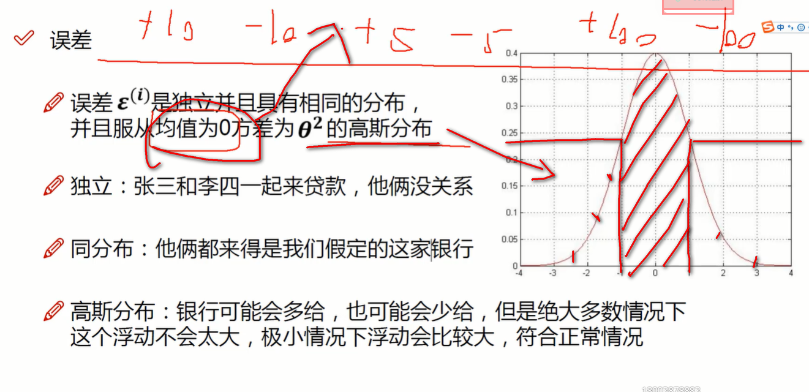
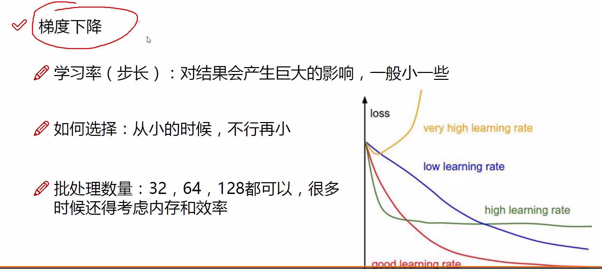

# Machine Learning   

## 概念的学习和Dem

###　什么是线性回归? 线性回归原理

```python
找出一条合适的线去拟合出数据点.
偏置项在训练过程中为了使模型更加的精准而进行的微调参数．　主要影响参数还是ｘ的值．
```


```python
误差: 真实值和预测值之间肯定存在一些差异. 这个差异就是误差. 
    机器学习就是通过数据通过模型的学习得到参数去尽可能地得到目标值(损失越小)
    没有数据可以绝对服从均值为0 方差为theta square 的高斯分布. 
    
```





### 梯度下降  


```
梯度下降, 学习率(步长), 会对结果产生巨大的影响, 我们一般选择小的数据 例如0.001 . 批处理数量根据内存和效率一般为32, 64, 128.
```



### 线性回归代码实现

