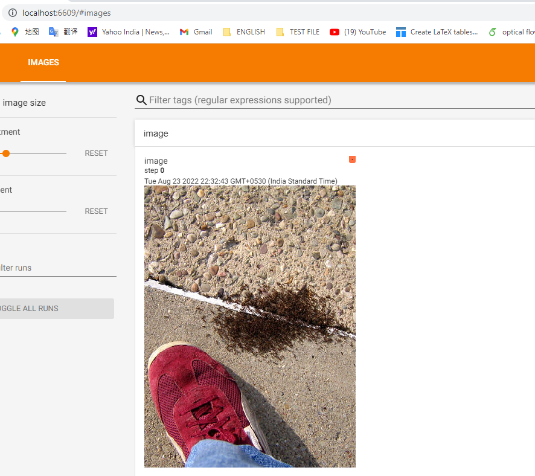

## Pytorch Learning: 

### Pytorch environment  and installation

### Py-torch data loading 

```python
# 1. Dataset  提供一种方式批量获取数据和标签.
# 2. Dataloader 为后续的网络运行提供数据加载形式.
数据的组织形式: 文件名作为标签名称, 图像名作为标签, 图像和标签分开整理.

"""
pytorch learning :
class dataset restructure:
init, getitem, len  three function should be rewrite
in __init__, root_dir, label_dir, data path, image_path list.
in __getitem__, idx, image_name, full image path, open image, and label_name
in __len__ , it is the length of dataset.

"""

from torch.utils.data import Dataset
import os
from PIL import Image

# parametes:
root_dir = "hymenoptera_data\\train"  # root_dir of dataset.
ants_label_dir = "ants"  # ants' label_dir.
bees_label_dir ="bees"  # bees' label_dir


class MyData(Dataset):
    def __init__(self, root_dir, label_dir):
        self.root_dir = root_dir
        self.label_dir = label_dir
        self.path = os.path.join(self.root_dir, self.label_dir)
        self.image_path = os.listdir(self.path)

    def __getitem__(self, idx):  # index of image
        image_name = self.image_path[idx]
        img_item_path = os.path.join(self.root_dir, self.label_dir, image_name)
        img = Image.open(img_item_path)
        label = self.label_dir
        return img, label

    def __len__(self):
        return len(self.image_path)


# 实例化数据
ants_data = MyData(root_dir, ants_label_dir)
bees_data = MyData(root_dir, bees_label_dir)
# merge small dataset to a train dataset.
TrainData = ants_data + bees_data
img, label = TrainData[45]
img.show() 
```

### Tensor board

```python
from torch.utils.tensorboard import SummaryWriter
import numpy as np
from PIL import Image
"""
This class is a drawing tools to monitor our steps and values. for training logs.
and train images display.
"""
# demo
# pi = 3.14
# Writer = SummaryWriter("logs")
# for i in range(1000):
#    Writer.add_scalar("y_values2", 2*i+pi, i)
# Writer.close()


# Demo 2
writer = SummaryWriter("logs")
image_path = "hymenoptera_data/train/ants/6743948_2b8c096dda.jpg"
img_pil = Image.open(image_path)  # 图像数据格式在tensorboard 需要 numpy or tensor,
image_array = np.array(img_pil)  # transform types of data
writer.add_image("image", image_array, 0, dataformats='HWC')  # shape 
writer.close()

"""
(studyTorch) F:\Study-file-python>tensorboard --logdir=logs --port=6609
TensorFlow installation not found - running with reduced feature set.
Serving TensorBoard on localhost; to expose to the network, use a proxy or pass --bind_all
TensorBoard 2.8.0 at http://localhost:6609/ (Press CTRL+C to quit)
"""

```



### Transform-torchvision

```python
"""
The transform under torchvision.
function:
    "Compose",
    "ToTensor",
    "PILToTensor",
    "ConvertImageDtype",
    "ToPILImage",
    "Normalize",
    "Resize",
    "CenterCrop",
    "Pad",
    "Lambda",
    "RandomApply",
    "RandomChoice",
    "RandomOrder",
    "RandomCrop",
    "RandomHorizontalFlip",
    "RandomVerticalFlip",
    "RandomResizedCrop",
    "FiveCrop",
    "TenCrop",
    "LinearTransformation",
    "ColorJitter",
    "RandomRotation",
    "RandomAffine",
    "Grayscale",
    "RandomGrayscale",
    "RandomPerspective",
    "RandomErasing",
    "GaussianBlur",
    "InterpolationMode",
    "RandomInvert",
    "RandomPosterize",
    "RandomSolarize",
    "RandomAdjustSharpness",
    "RandomAutocontrast",
    "RandomEqualize",
    totensor 为什么?  tensor 格式的数据打包包含装了我们学习网络的一些理论基础参数, 例如, 反向传播, 梯度, 设备, 等一系列的数据.
"""
# 单张图像的基础处理
from torchvision import transforms
import cv2 as cv
# loading an image
img_path = "hymenoptera_data/train/ants/6240338_93729615ec.jpg"
img = cv.imread(img_path)
print(img.shape)  # (181, 500, 3)
# transforms 类文件的一个实例化的过程.
transforms = transforms.ToTensor()  # 实例化对象
img_tensor = transforms(img)
print(img_tensor.shape)  # torch.Size([3, 181, 500])
print(type(img_tensor))  # <class 'torch.Tensor'>

```

### Transform , dataset,  DataLoader

```python
"""
Dataloader for self Dataset in pytorch.

"""
# dataset
from PIL import Image
from torch.utils.data import Dataset, DataLoader
import os

from torch.utils.tensorboard import SummaryWriter
from torchvision import transforms

root_dir = "hymenoptera_data/train"
label_dir = "ants"


class Mydata(Dataset):
    def __init__(self, root_dir, label_dir, transform=True):
        self.root_dir = root_dir
        self.label_dir = label_dir
        self.image_path = os.path.join(self.root_dir, self.label_dir)
        self.image_pac = os.listdir(self.image_path)
        self.transform = transforms.Compose([
            transforms.PILToTensor(),
            transforms.CenterCrop(100),
            transforms.Resize((80, 80))
        ])

    def __getitem__(self, idx):
        image_name = self.image_pac[idx]
        image_item_path = os.path.join(self.image_path, image_name)
        image = Image.open(image_item_path)
        # convers  to RGB
        image = image.convert("RGB")
        label = self.label_dir
        # transforms operator for each images
        if self.transform:
            image = self.transform(image)

        # sample = {"image": image, "label": label}

        return image, label

    def __len__(self):
        return len(self.image_pac)


# 实例化Dataset, DataLoader
dataset = Mydata(root_dir, label_dir)
dataloader = DataLoader(dataset=dataset, batch_size=16, shuffle=True, num_workers=0, drop_last=True)
"""
sample = dataset[0]
print(sample)  # {'image': tensor([[[ 82,  82,  82,  ...,  78,  78,  80],...[236, 238, 238,  ...,   3,   3,   5]]], dtype=torch.uint8), 'label': 'ants'}
print(type(dataloader))  # <class 'torch.utils.data.dataloader.DataLoader'>
dataiter = iter(dataloader)
samples = dataiter.next()
print(type(samples))
print(samples)  # 一次输出batchsize 的数据

"""
# 使用 tensorboard 去可视化我们取得数据
writer = SummaryWriter("dataloader")
step = 0
for data in dataloader:
    images, target = data
    print(images.shape)
    #print(images.shape)
    #print(target)
    writer.add_images("dataloader_vision", images, step)
    step = step+1
writer.close() # tensorboard --logdir="dataloader" to watch data vision.

```

### nn.Module

```python
"""
A simple nn.Module for neural networks.
"""

import torch
import torch.nn as nn
import torch.nn.functional as F

class Mymodule(nn.Module):
    def __init__(self):
        super().__init__()

    def forward(self, input):
        input = input + 2
        output = input
        return output


input = 3
model = Mymodule()
input = torch.tensor(input)
output = model(input)
print(output)
```

### Conv2d Demo

```python

"""
conv2d for self dataset
"""
import torch
from torch import nn
from torch.nn import Conv2d
from torch.utils.data import Dataset, DataLoader
import os
from PIL import Image
import torchvision
from torch.utils.tensorboard import SummaryWriter
from torchvision import transforms
# parametes:


root_dir = "hymenoptera_data\\train"  # root_dir of dataset.
ants_label_dir = "ants"  # ants' label_dir.
bees_label_dir ="bees"  # bees' label_dir


class MyData(Dataset):
    def __init__(self, root_dir, label_dir, transform=True):
        self.root_dir = root_dir
        self.label_dir = label_dir
        self.path = os.path.join(self.root_dir, self.label_dir)
        self.image_path = os.listdir(self.path)
        self.transform = transforms.Compose(
            [
                transforms.CenterCrop(100),
                transforms.Resize((100,100)),
                transforms.ToTensor()
            ]
        )

    def __getitem__(self, idx):  # index of image
        image_name = self.image_path[idx]
        img_item_path = os.path.join(self.root_dir, self.label_dir, image_name)
        img = Image.open(img_item_path)
        img = img.convert("RGB")
        label = self.label_dir
        if self.transform:
           img = self.transform(img)
        return img, label

    def __len__(self):
        return len(self.image_path)

#  create conv2d network.


class Myconv(nn.Module):
    def __init__(self):
        super(Myconv, self).__init__()
        self.conv1 = Conv2d(in_channels=3, out_channels=6, kernel_size=(3, 3), stride=(1, 1), padding=1)

    def forward(self, x):
        x = self.conv1(x)
        return x

# 实例化数据
ants_data = MyData(root_dir, ants_label_dir)
bees_data = MyData(root_dir, bees_label_dir)
# merge small dataset to a train dataset.
TrainData = ants_data + bees_data
trainData = DataLoader(TrainData,batch_size=16, shuffle=True,num_workers=0, drop_last=True)
conv2 = Myconv()  # 实例化网络类
writer = SummaryWriter("conv2d")
step = 0
for data in trainData:
    img, labels = data
    print("before input into net: ",img.shape)
    #print(labels)
    output = conv2(img)
    # 更改了out-channel 多余的维度会放到batchsize 上.
    output = torch.reshape(output, (-1, 3, 100, 100))
    print(output.shape)  # torch.Size([32, 3, 100, 100])
    writer.add_images("input_img", img, step)
    step = step+1
writer.close()
```

### sequential 

```python
 """
@Project : Study-file-python
@File    : .py
@Author  : Gary_H
@Date    : 26/08/2022 22:41
使用sequential 去简单书写神经网络.
"""
import torch
from torch import nn
from torch.nn import Conv2d, MaxPool2d, Flatten, Linear
from torch.utils.tensorboard import SummaryWriter


class Mynet(nn.Module):
    def __init__(self):
        super(Mynet, self).__init__()
        self.model = nn.Sequential(
            Conv2d(3, 32, (5, 5), padding=2),
            MaxPool2d(2),
            Conv2d(32, 32, (5, 5), padding=2),
            MaxPool2d(2),
            Conv2d(32, 64, (5, 5), padding=2),
            MaxPool2d(2),
            Flatten(),
            Linear(1024, 64),
            Linear(64, 10)
        )

    def forward(self, x):
        x = self.model(x)
        return x


# 实例化网络
mode = Mynet()
input = torch.ones((64, 3, 32, 32))
output = mode(input)
print(output.shape)  # torch.Size([64, 10])
# visional on website
writer = SummaryWriter("logs_sequential")
writer.add_graph(mode,input)
writer.close()
```

### Loss function

```python
# 损失函数 计算实际输出和目标之间的差距. 同时为我们输出的更新提供一定的依据.(反向传播)
# 数据, 网络的处理简化, 这里只关注了损失函数和梯度
loss = nn.CrossEntropyLoss()
for data in trainData:
    img, labels = data
    print(labels)
    # print(img.shape)  # (16,3,100,100)
    output = conv2(img)
    result_loss = loss(output, labels)  # 交叉熵损失函数, 对预判结果和真是结果进行比对得出一个结果值.
    result_loss.backward()  # 反向传播的权重在debug 中可看到.
    print(result_loss)

```

### optimizer 

~~~python
"""
@Project : Study-file-python
@File    : .py
@Author  : Gary_H
@Date    : 12/09/2022 16:15
optimizer  训练过程中优化器的使用
"""

import torch
from torch import nn
from torch.nn import Conv2d, MaxPool2d, Flatten, Linear
from torch.utils.data import Dataset, DataLoader
import os
from PIL import Image
import torchvision
from torch.utils.tensorboard import SummaryWriter
from torchvision import transforms


# parametes:
root_dir = "hymenoptera_data\\train"  # root_dir of dataset.
ants_label_dir = "ants"  # ants' label_dir.
bees_label_dir ="bees"  # bees' label_dir


class MyData(Dataset):
    def __init__(self, root_dir, label_dir, transform=True):
        self.root_dir = root_dir
        self.label_dir = label_dir
        self.path = os.path.join(self.root_dir, self.label_dir)
        self.image_path = os.listdir(self.path)
        self.transform = transforms.Compose(
            [
                transforms.CenterCrop(100),
                transforms.Resize((100,100)),
                transforms.ToTensor()
            ]
        )

    def __getitem__(self, idx):  # index of image
        image_name = self.image_path[idx]
        img_item_path = os.path.join(self.root_dir, self.label_dir, image_name)
        img = Image.open(img_item_path)
        img = img.convert("RGB")
        label = self.label_dir
        if label == "ants":
            label = 0
        else:
            label = 1
        if self.transform:
           img = self.transform(img)
        return img, label

    def __len__(self):
        return len(self.image_path)


#  create conv2d network.
class Mynet(nn.Module):
    def __init__(self):
        super(Mynet, self).__init__()
        self.model = nn.Sequential(
            Conv2d(3, 32, (5, 5), padding=2),
            MaxPool2d(2),
            Conv2d(32, 32, (5, 5), padding=2),
            MaxPool2d(2),
            Conv2d(32, 64, (5, 5), padding=2),
            MaxPool2d(2),
            Flatten(),
            Linear(9216, 128),
            Linear(128, 2)
        )

    def forward(self, x):
        x = self.model(x)
        return x


# 实例化数据
ants_data = MyData(root_dir, ants_label_dir)
bees_data = MyData(root_dir, bees_label_dir)
# merge small dataset to a train dataset.
TrainData = ants_data + bees_data
trainData = DataLoader(TrainData,batch_size=16, shuffle=True,num_workers=0, drop_last=True)
conv2 = Mynet()  # 实例化网络类

loss = nn.CrossEntropyLoss()
optimizer = torch.optim.SGD(conv2.parameters(), lr=0.01)
for epoch in range(20):
    print("epoch is :", epoch)
    running_loss = 0.0
    for data in trainData:
        img, labels = data
        # print("before input into net: ", img.shape)  # 16,3,100,100
        output = conv2(img)
        result_loss = loss(output, labels)
        optimizer.zero_grad()
        result_loss.backward()
        optimizer.step()
        running_loss = running_loss + result_loss
    print(running_loss)
~~~

### 模型的保存和读取

~~~python
保存办法: 保存了网络模型和相关的参数. 
    torch.save(model, "model-name.pth")  
   读取: model = torch.load("path--.pth")
    二: 把网络的状态保存为字典 只有模型参数. 这个保存是官方推荐, 更加具有优势.
        torch.save(model.state_dict(), "model-name.pth")
    
~~~

### 跑一个完整的分类任务

~~~python
"""
@Project : crf10-classification
@File    : .py
@Author  : Gary_H
@Date    : 12/09/2022 19:44
dataset cifar 10  net-name: cifar10
net frame  3@32*32  conv(5*5), 32@32*32 mp(2*2), conv(32@16*16)
"""
import torch
import torchvision
from torch import nn
from torch.utils.data import DataLoader
from torch.utils.tensorboard import SummaryWriter

from Cifar10 import *


# preparing datasets
train_data = torchvision.datasets.CIFAR10(root="./data", train=True, transform=torchvision.transforms.ToTensor(),
                                          download=True)
test_data = torchvision.datasets.CIFAR10(root="./data",train=False,transform=torchvision.transforms.ToTensor(),
                                         download=True)

train_data_size = len(train_data)
test_data_size = len(test_data)
print("train-data_length: {}".format(train_data_size))  # train-data length50000
print("test_data_length: {}".format(test_data_size))


# loading dataset
train_dataloader = DataLoader(train_data, batch_size=16)
test_dataloader = DataLoader(test_data, batch_size=16)


# to start train
model = Mynet
loss_func = nn.CrossEntropyLoss()
learning_rate = 0.001
optimizer = torch.optim.SGD(model.parameters(), lr=learning_rate)
# set net of train parameters
total_train_step = 0
total_test_step = 0
epoch = 10
# 画图显示训练结果
writer = SummaryWriter("./logs_train")

for i in range(epoch):
    print("-----第{} 轮训练-----".format(i+1))
    model.train()  # 这里添加的作用:  查看文档
    for data in train_dataloader:
        imgs, targets = data
        # print(imgs.shape)  # torch.Size([16, 3, 32, 32])
        output = model(imgs)
        loss = loss_func(output, targets)
        # optimizer model
        optimizer.zero_grad()
        loss.backward()
        optimizer.step()
        total_train_step += 1
        if total_train_step % 100 == 0:
            print("训练次数{}, loss: {}".format(total_train_step, loss.item()))
            writer.add_scalar("train_loss", loss.item(), total_train_step)  # 训练loss
# test steps
    model.eval()  # 测试模块
    total_test_loss = 0
    total_accuracy = 0  # preds
    with torch.no_grad():
        for data in test_dataloader:
            imgs, targets = data
            output = model(imgs)
            loss_test = loss_func(output, targets)
            total_test_loss += loss_test.item()
            accuracy = (output.argmax(1) == targets).sum()
            total_accuracy = total_accuracy + accuracy
    print("整体测试集上的loss: {}".format(total_test_loss))
    print("整体测试集上的accuracy: {}".format(total_accuracy/test_data_size))
    writer.add_scalar("test_accuracy", total_accuracy/test_data_size, total_test_step)
    writer.add_scalar("test_total_loss", total_test_loss, total_test_step)
    total_test_step += 1
    # 保存每一个轮训练的一个model
    torch.save(model, "./sifar10_{}.pth".format(i+1))
    print("模型已经保存...")

writer.close()

~~~

### GPU 训练

~~~python
~~~

### 验证模型

~~~ python
"""
@Project : crf10-classification
@File    : .py
@Author  : Gary_H
@Date    : 12/09/2022 22:42
验证模型
"""
import torch
import torchvision
from PIL import Image
from torch import nn

root = "F:\pythonProject\crf10-classification\image\cat.jpg"
image_path = root
image = Image.open(image_path)
# 图像通道转换
image = image.convert('RGB')
transform = torchvision.transforms.Compose([
    torchvision.transforms.Resize((32, 32)),
    torchvision.transforms.ToTensor()
])
image = transform(image)
# load net


class Mynet(nn.Module):
    def __init__(self):
        super(Mynet, self).__init__()
        self.model = nn.Sequential(
            nn.Conv2d(3, 32, (5, 5), stride=(1, 1), padding=2),
            nn.MaxPool2d((2, 2)),
            nn.Conv2d(32, 32, (5, 5), stride=(1, 1), padding=2),
            nn.MaxPool2d(2, 2),
            nn.Conv2d(32, 64, kernel_size=(5, 5), stride=(1, 1), padding=2),
            nn.MaxPool2d(2, 2),
            nn.Flatten(),
            nn.Linear(64*4*4, 64),
            nn.Linear(64, 10)

        )

    def forward(self, x):
        x = self.model(x)
        return x


model = torch.load("sifar10_10.pth")
print(model)
image = torch.reshape(image, (1, 3, 32, 32))
model.eval()
with torch.no_grad():  # 非常好的一步, 节约内存
    output = model(image)
print(output)  # tensor([[-1.3187, -5.6638,  4.0470,  3.3831,  3.4556,  6.1369, -2.3145,  3.4667, -6.4005, -4.9906]])
print(output.argmax(1))  # tensor([5])

~~~

